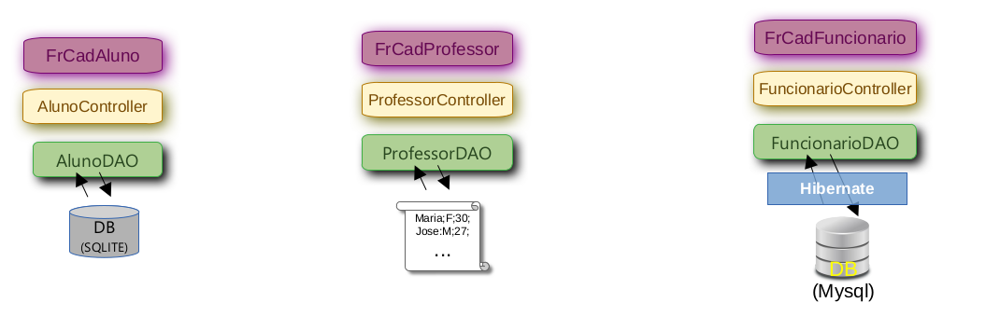

# ProjetoDacc_LPS: Java Swing Application

Este projeto pertence a disciplina LABORATORIO DE PROGRAMAÇÃO DE SISTEMAS.
- Ele parte do ponto de chegada da disciplina de Orientação a Objetos
- Com foco em aprimoramentos, frameworks e novas funcionalidades. 
- Confira os principais pontos de destaque:

## Novidades e Melhorias
- Utilização do **Maven** para gerenciamento de dependências.
- Utilização do padrão MVC
- Implementação com banco de dados usando JDBC.
- Adoção do framework JPA-Hibernate.

## Gerenciamento de Dependências com Maven
- Utilizamos o Maven como gerenciador de dependências do projeto. 
- As dependências estão especificadas no arquivo `POM.xml`.
- Se precisar adicionar novas dependências, consulte o [repositório central Maven](https://search.maven.org/) ou o [mvnrepository](https://mvnrepository.com/).

## Projeto Escola: Estrutura Didática
- **Cadastro de Professor**: Utiliza armazenamento em arquivo texto.
- **Cadastro de Aluno**: Adota o banco de dados SQLite com a tecnologia JDBC.
- **Cadastro de Funcionário**:
  - Implementado com JPA-Hibernate.
  - Utiliza o banco de dados MySQL.
  - Nota: Por simplicidade, a entidade "Funcionário" não foi derivada da entidade "Pessoa".



## Padrão MVC
O padrão MVC foi adotado, o que permite uma clara separação entre as camadas VIEW e CONTROLLER. Esta estruturação garante que essas camadas permaneçam consistentes, independentemente das abordagens utilizadas na camada MODEL.


## Padrão Factory
Estamos utilizando o padrão Factory tanto para conexões com o banco de dados SQLite quanto para a criação do `EntityManager` do Hibernate.

## Conceitos Orientação a Objetos
Os conceitos de Herança, Interface e Polimorfismo estão presentes na camada MODEL, especificamente no DAO. Isso evidencia como uma camada MODEL bem estruturada mantém as camadas VIEW e CONTROLLER consistentes e desacopladas.

## Hibernate e MySQL
- O Hibernate está configurado especificamente para a classe "Funcionário".
- Este é um exemplo puramente didático.
- **Atenção**:
  - Estamos utilizando o banco de dados MySQL. Se você deseja executar esta parte do projeto, certifique-se de ter o MySQL instalado e configurado em sua máquina.
  - Crie um banco de dados chamado 'db001'. O JPA-Hibernate cuidará da criação das tabelas necessárias.
  - Se desejar alterar o nome do banco de dados, modifique o arquivo `persistence.xml`.

```xml
<?xml version="1.0" encoding="UTF-8"?>
<persistence version="2.1" xmlns="http://xmlns.jcp.org/xml/ns/persistence" xmlns:xsi="http://www.w3.org/2001/XMLSchema-instance" xsi:schemaLocation="http://xmlns.jcp.org/xml/ns/persistence     http://xmlns.jcp.org/xml/ns/persistence/persistence_2_1.xsd">
  <persistence-unit name="exemplo-jpa" transaction-type="RESOURCE_LOCAL">
    <properties>
      <property name="javax.persistence.jdbc.url" value="jdbc:mysql://localhost/db0001?useSSL=false&amp;serverTimezone=UTC"/>
      <property name="javax.persistence.jdbc.driver" value="com.mysql.jdbc.Driver"/>
      <property name="javax.persistence.jdbc.user" value="root"/>
      <property name="javax.persistence.jdbc.password" value="password"/>
      <property name="hibernate.hbm2ddl.auto" value="update"/>
      <!-- https://docs.jboss.org/hibernate/orm/5.4/javadocs/org/hibernate/dialect/package-summary.html -->
      <property name="hibernate.dialect" value="org.hibernate.dialect.MySQL8Dialect"/>
      
      <property name="hibernate.format_sql" value="true"/>
      <property name="hibernate.show_sql" value="true"/>
      
    </properties>
  </persistence-unit>
</persistence>
```

## Conclusão
Esperamos que este projeto sirva como uma referência valiosa para seus estudos e desenvolvimento em Java Swing com integração ao JPA-Hibernate. Qualquer feedback ou contribuição é muito bem-vindo!


